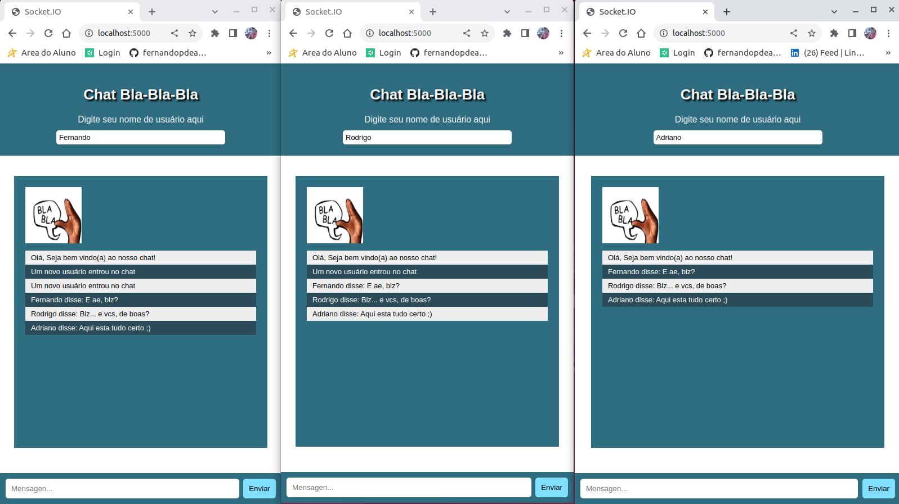

# Projeto `Chat-bla-bla-bla`!
Chat usando socket.io, nodejs, express, html, css e javascript

<details>
  <summary><strong>👨‍💻 Habilidades!</strong></summary>
    <p>Faça o clone do repositório 🍛</p>

🚵 Habilidades exercitadas: </br>

-   Praticar `css`; </br>
-   Praticar `html`; </br>
-   Praticar `javascript`; </br>
-   Praticar `nodejs`; </br>
-   Praticar `socket.io`. </br>

</details>

<details>
  <summary>
    <b>👀 Como instalar as dependências e rodar a aplicação?</b>
  </summary>

Instale as dependências com o comando:

```bash
npm install ou npm i
```

Certifique-se de que tem o nodemon instalado na máquina, e rode esse comando para iniciar a aplicação:

```bash
npm start
```

Agora abra seu navegador em = http://localhost:5000

 Pronto !!! :)

</details>




